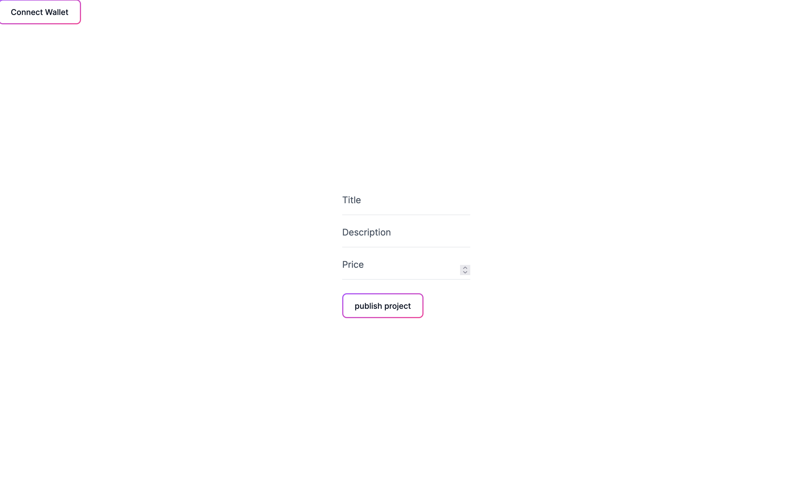
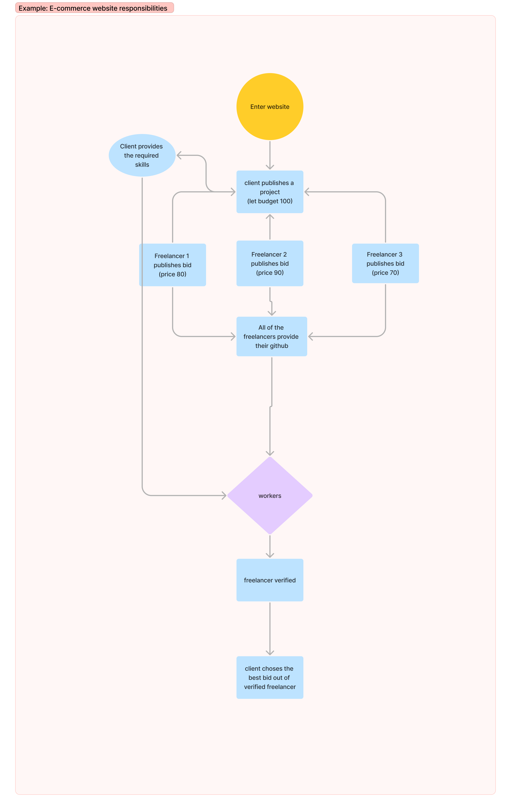
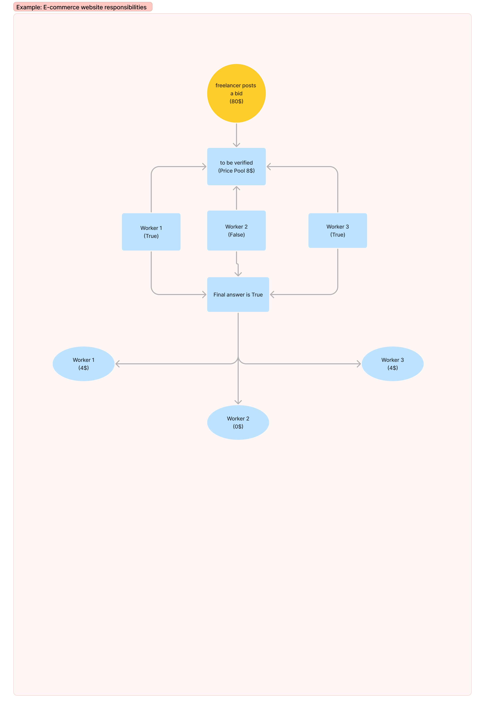

Welcome to DecFree

A Decentralised Freelancing platform built on top of soroban

There are 3 paths
Client,Freelancer and Worker

first start the backend server

cd backend
npx tsc -b
cd dist
node index

Client publishes the project

cd client-frontend
npm run dev

Freelancer takes the project
cd client-frontend
npm run dev

Now the worker votes on if the candidate is right using the Voting Smart-contract
cd soroban-contract/contracts/Voting

After that the worker gets payment if and only if it gets within the majority of the votes(this feature is yet at the developing stage)

# DecFree
